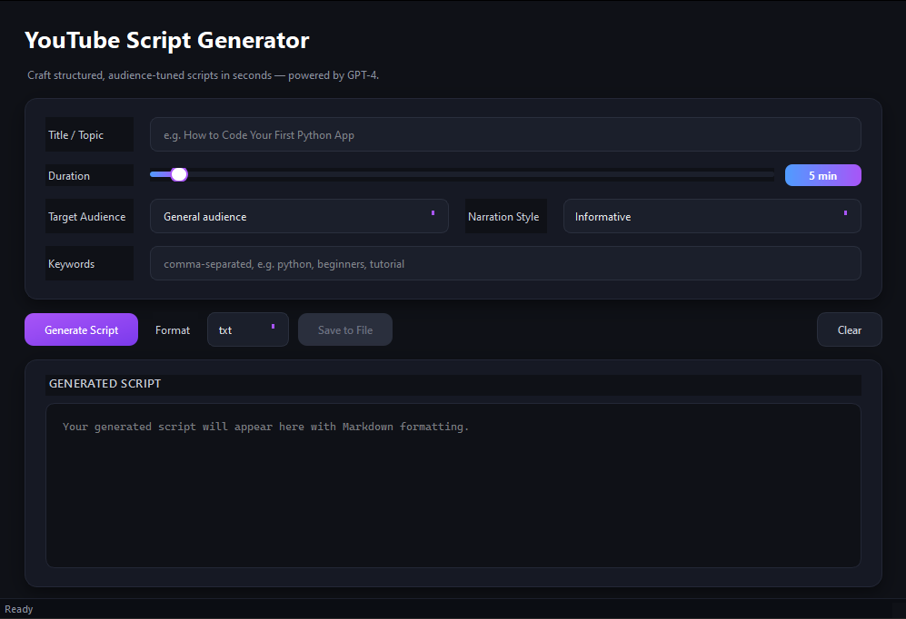

# YouTube Script Generator

**Turn a one-line idea into a fully structured, audience-tuned YouTube script — powered by GPT-4 and wrapped in a modern, animated PyQt6 desktop interface.**

<p align="center">
  
  
  
  
  
</p>

---

## Overview

**YouTube Script Generator** is a standalone desktop application that transforms a short video brief (title, duration, audience, tone, keywords) into a professionally structured YouTube script with clear **Introduction**, **Body**, and **Conclusion** sections. Built with **PyQt6**, it offers a vibrant dark-mode UI, smooth animations, Markdown-rendered output, and one-click export to `.txt` or `.md`.

Whether you are a creator, educator, marketer, or developer exploring Qt and LLMs, this tool is designed to be **fast, beautiful, and genuinely useful**.

---

## Key Features

- **AI-Powered Script Generation**: Integrates directly with the **OpenAI GPT-4 API** to generate high-quality, platform-optimized scripts tailored to your audience and narration style.
- **Modern PyQt6 UI**: A professionally designed interface with a deep dark-mode theme, vibrant neon-purple and electric-blue accents, rounded corners, and gradient buttons — no stock Windows/Mac look.
- **Smooth Animations**: Fade-in window transition, animated glow effects on button hover (via `QPropertyAnimation` + `QGraphicsDropShadowEffect`), and an indeterminate gradient progress bar as the loading indicator.
- **Markdown-Rendered Output**: The script appears in a live Markdown view, preserving headings, bold emphasis, lists, and code blocks for effortless readability.
- **Interactive Form Controls**: Stylized `QSlider` for duration with a live chip readout, editable `QComboBox` dropdowns for audience and style, and placeholder-guided text inputs.
- **Non-Blocking UX**: All network calls run on a background `QThread`, so the UI stays silky-smooth during generation.
- **Smart File Export**: Save as `.txt` or `.md` with automatic, date-stamped file names (e.g., `How_to_Code_2026-04-18.md`) inside a managed `exports/` folder. No overwrites — duplicates get numeric suffixes.
- **Graceful Offline Mode**: If no `OPENAI_API_KEY` is configured, the app falls back to a clearly-labeled placeholder script so you can still test the full UI and export pipeline.
- **Robust Error Handling**: Connection failures, invalid keys, and file I/O errors are surfaced through clear, styled dialogs — never a silent crash.

---

## Screenshot

> Drop your screenshots and a short GIF into the `docs/` folder and reference them below.

<p align="center">
  
</p>

<p align="center">
  <em>Main window — form, slider, and Markdown output panel</em>
</p>

<!-- <p align="center">
  
</p>

<p align="center">
  <em>Animated demo — fade-in, button glow, live slider, and gradient loading bar</em>
</p> -->

---

## Tech Stack

| Category | Technology |
|---|---|
| Language | **Python 3.10+** |
| GUI Framework | **PyQt6** (`QtWidgets`, `QtCore`, `QtGui`) |
| Styling | **Qt Style Sheets (QSS)** — custom dark theme with gradients |
| Animations | `QPropertyAnimation`, `QGraphicsDropShadowEffect`, `QEasingCurve` |
| AI Backend | **OpenAI API** (`gpt-4` via the official `openai` Python SDK) |
| Threading | `QThread` with signal/slot communication |
| File I/O | `pathlib`, Markdown-aware export pipeline |
| Packaging | `pip` + `requirements.txt` |

---

## Installation

### 1. Prerequisites

- **Python 3.10 or newer** — [python.org/downloads](https://www.python.org/downloads/)
- A working **pip** (bundled with modern Python installs)
- *(Optional)* An **OpenAI API key** for real GPT-4 generation — [platform.openai.com/api-keys](https://platform.openai.com/api-keys)

### 2. Clone the Repository

```bash
git clone <url>
cd youtube-script-generator
```

### 3. Create a Virtual Environment (recommended)

```bash
# Windows
python -m venv .venv
.venv\Scripts\activate

# macOS / Linux
python3 -m venv .venv
source .venv/bin/activate
```

### 4. Install Dependencies

```bash
pip install -r requirements.txt
```

### 5. Configure Your API Key (optional but recommended)

The app reads the key from the `OPENAI_API_KEY` environment variable. Without it, the app runs in offline placeholder mode.

**Option A — environment variable (recommended)**

```bash
# Windows (persistent)
setx OPENAI_API_KEY "sk-your-key-here"

# macOS / Linux
export OPENAI_API_KEY="sk-your-key-here"
```

**Option B — `.env` file (local only, never commit)**

Create a `.env` file next to `main.py`:

```env
OPENAI_API_KEY=sk-your-key-here
```

Then load it before launching (for example, with `python-dotenv` or your shell's dotenv support).

---

## Usage

### Launch the Application

```bash
python main.py
```

The window will fade in with the dark theme applied.

### Generate a Script

1. Fill in the **Title / Topic** (e.g., *"How to Code Your First Python App"*).
2. Drag the **Duration** slider to your desired length (1–120 minutes).
3. Pick or type a **Target Audience** (e.g., *Beginners*, *Developers*).
4. Choose a **Narration Style** from the dropdown (Informative, Entertaining, Technical, Dramatic, ...).
5. Add optional **Keywords**, comma-separated.
6. Click **Generate Script** — the loading bar animates while GPT-4 composes your script.
7. Review the rendered Markdown output in the right-hand panel.

### Save Your Script

1. After generation, the app asks whether you want to save.
2. Alternatively, pick a format (`txt` or `md`) and click **Save to File** at any time.
3. Files are saved to the `exports/` folder with smart, date-stamped names:

```
exports/
├── How_to_Code_2026-04-18.txt
├── How_to_Code_2026-04-18.md
└── How_to_Code_2026-04-18_1.md   (automatic suffix if the file already exists)
```

---

## Project Structure

```
youtube-script-generator/
├── main.py              # Application entry point (GUI + AI + export logic)
├── requirements.txt     # Python dependencies
├── README.md            # You are here
├── LICENSE              # MIT license
├── .gitignore           # Git exclusions
├── docs/                # Screenshots, demo GIFs, design notes
└── exports/             # Auto-created on first save
```

---

## Contributing

Contributions are warmly welcomed — whether you are fixing a bug, polishing the UI, adding new export formats, or integrating additional AI providers.

### How to contribute

1. **Fork** the repository.
2. Create a feature branch: `git checkout -b feature/my-improvement`
3. Commit your changes with clear messages: `git commit -m "Add: something useful"`
4. Push to your fork: `git push origin feature/my-improvement`
5. Open a **Pull Request** and describe the motivation, changes, and any screenshots.

### Contribution guidelines

- Keep all code and comments in **English**.
- Match the existing code style (PEP 8, type hints where helpful).
- Preserve the modular separation between domain logic and GUI layer.
- Include screenshots for any UI-facing change.
- If you add a dependency, update `requirements.txt` with a sensible minimum version.

### Issues & Feature Requests

Found a bug or have an idea? Please [open an issue](https://github.com/<your-username>/youtube-script-generator/issues) with a clear description, reproduction steps (if applicable), and screenshots where helpful.

---

## Roadmap

- [ ] Per-request model picker (GPT-4, GPT-4o, GPT-4 Turbo)
- [ ] Temperature & tone sliders
- [ ] PDF export via `reportlab`
- [ ] Built-in "Recent Scripts" history panel
- [ ] Multi-language script generation
- [ ] Thumbnail prompt companion (DALL-E integration)

---

## License

Distributed under the **MIT License**. See [LICENSE](LICENSE) for the full text.

```
MIT License — Copyright (c) 2026
Permission is hereby granted, free of charge, to any person obtaining a copy
of this software and associated documentation files (the "Software"), to deal
in the Software without restriction, including without limitation the rights
to use, copy, modify, merge, publish, distribute, sublicense, and/or sell
copies of the Software, and to permit persons to whom the Software is
furnished to do so, subject to the following conditions:
[see LICENSE file for the full terms]
```

---

## Acknowledgments

- **OpenAI** — for the GPT-4 API that powers generation.
- **Riverbank Computing** and **The Qt Company** — for PyQt6 and the Qt framework.
- The open-source community — for the countless tools and tutorials that made this project possible.

---

<p align="center">
  <em>Built with care for creators who value both content and craft.</em><br>
  <strong>If this project helps you, please consider giving it a star.</strong>
</p>
